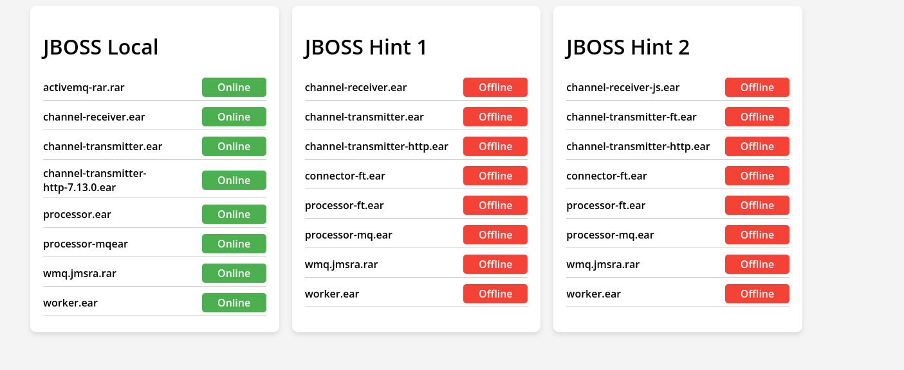

# Projeto de Monitoramento JBoss

Este projeto inclui um servidor HTTP para monitorar e exibir o status dos módulos de vários servidores JBoss em tempo real.

## Funcionalidades

- Monitoramento em tempo real dos módulos de três servidores JBoss diferentes.
- Interface visual para exibir o status de cada módulo.
- Atualizações automáticas do status a cada 2 segundos.

## Tecnologias Utilizadas

- Python 3.x
- Bibliotecas: `http.server`, `socketserver`, `requests`, `json`, `threading`, `time`

## Estrutura do Projeto

```plaintext
/projeto
│
├── server.py             # Script principal que executa o servidor HTTP e os monitoramentos
└── screenshot            # Pasta contendo screenshots da interface do projeto
    └── imagem.png        # Screenshot da interface de usuário
```

## Configuração e Execução

### Pré-requisitos

Certifique-se de ter Python 3.x instalado em seu sistema. Além disso, você precisará instalar a biblioteca `requests`:

```bash
pip install requests
```

### Execução

Para iniciar o servidor e o monitoramento, execute o seguinte comando no diretório do projeto:

```bash
python server.py
```

O servidor iniciará na porta 1234, e você poderá acessar a interface web através do navegador em `http://localhost:1234`.

## Contribuição

Sinta-se livre para contribuir com melhorias no código ou na funcionalidade. Para isso, por favor, siga os seguintes passos:

1. Fork o repositório.
2. Crie uma nova branch (`git checkout -b feature/nome_da_feature`).
3. Faça suas alterações.
4. Envie suas alterações (`git commit -am 'Adicionar alguma feature'`).
5. Envie para a branch (`git push origin feature/nome_da_feature`).
6. Abra um Pull Request.

## Licença

Este projeto está licenciado sob a MIT License - veja o arquivo [LICENSE.md](LICENSE.md) para detalhes.

## Captura de Tela

Aqui está uma captura de tela da interface do projeto:



## Contato

[Wagner Duarte] - [duartti@gmail.com]
